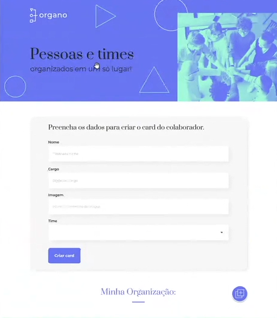

# React com JavaScript

> Curso de React da Alura onde será desenvolvido uma página web com React e Javascript.  

- A aplicação se chamará Organo e vai permitir que a configuremos e cadastremos a organização da nossa empresa.
- Nessas imagens vocês encontrar o rosto dos nossos instrutores separados pelas Escolas das quais eles fazem parte.
- A ideia é conseguirmos adicionar dinamicamente pessoas a esses times.

